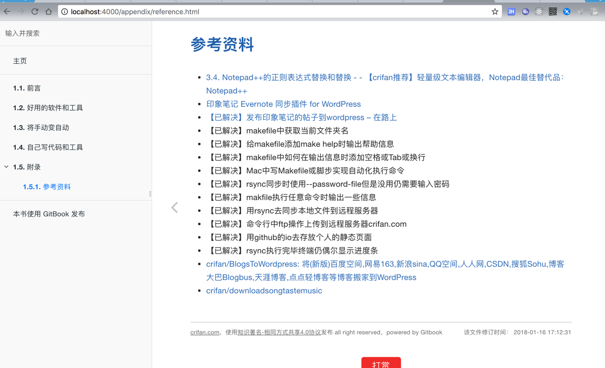
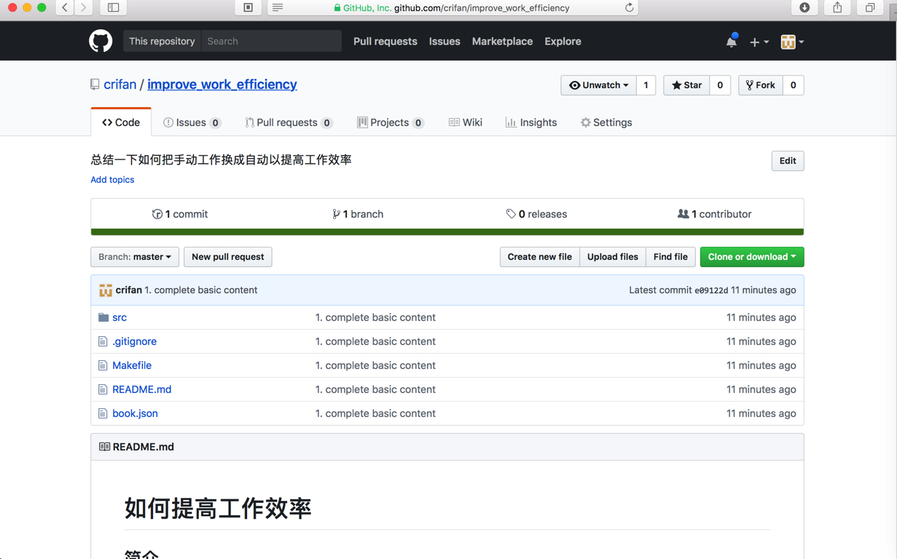

# 电子书制作过程

新建一个`Gitbook`电子书，主要有两种方式：

* `Gitbook Editor`：用Gitbook Editor创建book+同步到远端git仓库
  * 关于`Gitbook Editor`的使用，详见：[`Gitbook Editor`章节](../gitbook_editor/README.md)
* `纯命令行`：`gitbook-cli`及相关的成套工具
  * 直接用`git`创建本地仓库
  * 用`gitbook init`创建本地的`book`
  * 用`git`同步到远端仓库

下面就来介绍，如何用`gitbook`的命令行工具，去制作自己的电子书。

## 准备工作

我们需要一个`git`代码仓库，用于保存自己的`gitbook`的源码。

此处选用`github`。所以先去github中，新建一个空的git仓库，比如：

https://github.com/crifan/improve_work_efficiency.git

## 初始化`gitbook`

用：

```bash
gitbook init
```

去创建一个空的`book`：

举例：

```bash
➜  Import gitbook init improve_work_efficiency
warn: no summary file in this book
info: create README.md
info: create SUMMARY.md
info: initialization is finished
```

## 编辑`gitbook`的`markdown`源码

去编辑相关的`gitbook`的`markdown`的源码，以及相关的`book.json`等内容

比如我去拷贝别的book的内容过来后，文件如下：

```bash
➜  improve_work_efficiency git:(master) ✗ git status
On branch master

No commits yet

Untracked files:
  (use "git add <file>..." to include in what will be committed)

    .gitignore
    Makefile
    README.md
    book.json
    src/

nothing added to commit but untracked files present (use "git add" to track)
```

然后再继续去编辑内容

## `gitbook install`安装插件

在`book.json`配置好之后，要去安装对应的`gitbook`的插件。

```bash
  improve_work_efficiency git:(master) ✗ gitbook install
info: installing 16 plugins using npm@3.9.2
info:
info: installing plugin "theme-comscore"
info: install plugin "theme-comscore" (*) from NPM with version 0.0.3
/Users/crifan/GitBook/Library/Import/improve_work_efficiency
└── gitbook-plugin-theme-comscore@0.0.3

info: >> plugin "theme-comscore" installed with success
info:
info: installing plugin "search-plus"
runTopLevelLifecycles → 3 ▐ ╢████████████████████████████████████████████████████████████████████████████████████████████████████████████████████████████░░░░╟
/Users/crifan/GitBook/Library/Import/improve_work_efficiency
├─┬ gitbook-plugin-search-plus@1.0.3
│ └── html-entities@1.2.0
└── gitbook-plugin-theme-comscore@0.0.3
...
info: >> plugin "alerts" installed with success
info:
info: installing plugin "toolbar-button"
postinstall:gitbook-plugi ▌ ╢███████████████████████████████████████████████████████████████████████████████████████████████████████████████████████████░░░░░╟
/Users/crifan/GitBook/Library/Import/improve_work_efficiency
├── gitbook-plugin-alerts@0.2.0
├── gitbook-plugin-copy-code-button@0.0.2
├── gitbook-plugin-disqus@0.1.0
├── gitbook-plugin-donate@1.0.2
├── gitbook-plugin-expandable-chapters-small@0.1.7
├── gitbook-plugin-ga@1.0.1
├── gitbook-plugin-github-buttons@3.0.0
├── gitbook-plugin-prism@2.3.0
├── gitbook-plugin-prism-themes@0.0.2
├── gitbook-plugin-search-plus@1.0.3
├── gitbook-plugin-sharing-plus@0.0.2
├── gitbook-plugin-sitemap-general@0.1.1
├── gitbook-plugin-splitter@0.0.8
├── gitbook-plugin-tbfed-pagefooter@0.0.1
├── gitbook-plugin-theme-comscore@0.0.3
└── gitbook-plugin-toolbar-button@0.0.1

info: >> plugin "toolbar-button" installed with success
```

## 本地调试

然后用我自己写的[一键发布](../one_key_publish/README.md)中的`Makefile`去调试：

```bash
➜  improve_work_efficiency git:(master) ✗ make debug
--------------------------------------------------------------------------------
Author  : crifan.com
Version : 20171231
Function: Auto use gitbook to generated files: website/pdf/epub/mobi; upload to remote server; commit to github io repo
        Run 'make help' to see usage
--------------------------------------------------------------------------------
rm -rf /Users/crifan/GitBook/Library/Import/improve_work_efficiency/debug
mkdir -p /Users/crifan/GitBook/Library/Import/improve_work_efficiency/debug
gitbook serve /Users/crifan/GitBook/Library/Import/improve_work_efficiency /Users/crifan/GitBook/Library/Import/improve_work_efficiency/debug
Live reload server started on port: 35729
Press CTRL+C to quit ...

info: 23 plugins are installed
info: 19 explicitly listed
info: loading plugin "search-plus"... OK
info: loading plugin "disqus"... OK
info: loading plugin "prism"... OK
info: loading plugin "prism-themes"... OK
info: loading plugin "github-buttons"... OK
info: loading plugin "splitter"... OK
info: loading plugin "sharing-plus"... OK
info: loading plugin "tbfed-pagefooter"... OK
info: loading plugin "expandable-chapters-small"... OK
info: loading plugin "ga"... OK
info: loading plugin "donate"... OK
info: loading plugin "sitemap-general"... OK
info: loading plugin "copy-code-button"... OK
info: loading plugin "alerts"... OK
info: loading plugin "toolbar-button"... OK
info: loading plugin "livereload"... OK
info: loading plugin "fontsettings"... OK
info: loading plugin "theme-comscore"... OK
info: loading plugin "theme-default"... OK
info: found 6 pages
info: found 1 asset files
warn: "options" property is deprecated, use config.get(key) instead
warn: "options.generator" property is deprecated, use "output.name" instead
init!
finish!
info: >> generation finished with success in 1.3s !

Starting server ...
Serving book on http://localhost:4000
Restart after change in file src/good_tool_soft/README.md
```

然后即可在浏览器打开：

http://localhost:4000

去看自己的`book`的内容了：



## 把`gitbook`源码上传到远程仓库中

接着就是把`gitbook`的源码去上传到远程的`github`的`git`仓库中。

如果你对`git`操作很熟悉，可以忽略下面内容而自行操作。

### git创建本地仓库

```bash
➜  Import cd improve_work_efficiency
➜  improve_work_efficiency ll
total 16
-rw-r--r--  1 crifan  staff    16B  1 16 14:03 README.md
-rw-r--r--  1 crifan  staff    40B  1 16 14:03 SUMMARY.md
➜  improve_work_efficiency git init
Initialized empty Git repository in /Users/crifan/GitBook/Library/Import/improve_work_efficiency/.git/
➜  improve_work_efficiency git:(master) ✗ git status
On branch master

No commits yet

Untracked files:
  (use "git add <file>..." to include in what will be committed)

    README.md
    SUMMARY.md

nothing added to commit but untracked files present (use "git add" to track)
```

### 用`git add`把文件加入到本地

```bash
➜  improve_work_efficiency git:(master) ✗ git status
On branch master

No commits yet

Untracked files:
  (use "git add <file>..." to include in what will be committed)

    .gitignore
    Makefile
    README.md
    book.json
    src/

nothing added to commit but untracked files present (use "git add" to track)
➜  improve_work_efficiency git:(master) ✗ git add *
The following paths are ignored by one of your .gitignore files:
debug
node_modules
Use -f if you really want to add them.
➜  improve_work_efficiency git:(master) ✗ git status
On branch master

No commits yet

Changes to be committed:
  (use "git rm --cached <file>..." to unstage)

    new file:   Makefile
    new file:   README.md
    new file:   book.json
    new file:   src/README.md
    new file:   src/SUMMARY.md
    new file:   src/appendix/README.md
    new file:   src/appendix/reference.md
    new file:   src/assets/favicon.ico
    new file:   src/good_tool_soft/README.md
    new file:   src/manual_to_automatic/README.md
    new file:   src/self_write_soft/README.md

Untracked files:
  (use "git add <file>..." to include in what will be committed)

    .gitignore

➜  improve_work_efficiency git:(master) ✗ git add .gitignore
➜  improve_work_efficiency git:(master) ✗ git status
On branch master

No commits yet

Changes to be committed:
  (use "git rm --cached <file>..." to unstage)

    new file:   .gitignore
    new file:   Makefile
    new file:   README.md
    new file:   book.json
    new file:   src/README.md
    new file:   src/SUMMARY.md
    new file:   src/appendix/README.md
    new file:   src/appendix/reference.md
    new file:   src/assets/favicon.ico
    new file:   src/good_tool_soft/README.md
    new file:   src/manual_to_automatic/README.md
    new file:   src/self_write_soft/README.md
```

### 用`git commit`提交文件到本地仓库

```bash
➜  improve_work_efficiency git:(master) ✗ git commit -m "1. complete basic content"
[master (root-commit) e09122d] 1. complete basic content
 12 files changed, 1017 insertions(+)
 create mode 100644 .gitignore
 create mode 100644 Makefile
 create mode 100644 README.md
 create mode 100644 book.json
 create mode 100644 src/README.md
 create mode 100644 src/SUMMARY.md
 create mode 100644 src/appendix/README.md
 create mode 100644 src/appendix/reference.md
 create mode 100644 src/assets/favicon.ico
 create mode 100644 src/good_tool_soft/README.md
 create mode 100644 src/manual_to_automatic/README.md
 create mode 100644 src/self_write_soft/README.md
```

### 用`git remote add`后`git push`去推送内容到远端git仓库

```bash
➜  improve_work_efficiency git:(master) git push
fatal: No configured push destination.
Either specify the URL from the command-line or configure a remote repository using

    git remote add <name> <url>

and then push using the remote name

    git push <name>

➜  improve_work_efficiency git:(master) git remote add origin https://github.com/crifan/improve_work_efficiency.git
➜  improve_work_efficiency git:(master) git push
fatal: The current branch master has no upstream branch.
To push the current branch and set the remote as upstream, use

    git push --set-upstream origin master

➜  improve_work_efficiency git:(master) git push --set-upstream origin master
Counting objects: 19, done.
Delta compression using up to 4 threads.
Compressing objects: 100% (14/14), done.
Writing objects: 100% (19/19), 10.48 KiB | 2.10 MiB/s, done.
Total 19 (delta 1), reused 0 (delta 0)
remote: Resolving deltas: 100% (1/1), done.
To https://github.com/crifan/improve_work_efficiency.git
 * [new branch]      master -> master
Branch master set up to track remote branch master from origin.
```

然后远端git仓库github上就可以看到代码了：

crifan/improve_work_efficiency: 总结一下如何把手动工作换成自动以提高工作效率

https://github.com/crifan/improve_work_efficiency



## 之后每次更新代码重新上传最新代码

每次编辑更新`gitbook`的`markdown`源码后，再去：

```bash
git add *
git commit -m "describe your update"
git push
```

即可上传最新改动。
