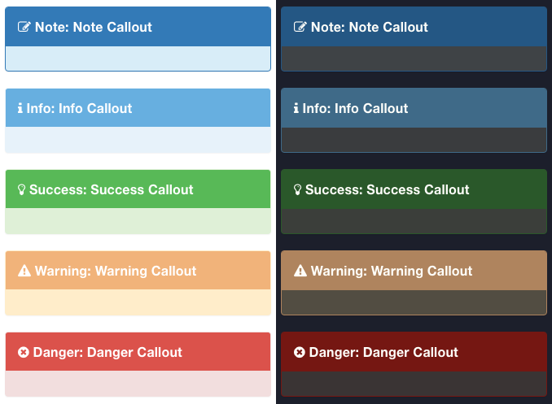

# 提示和标注

目前在用的`提示`的插件是：

[gitbook-plugin-callouts](https://github.com/gubler/gitbook-plugin-callouts)

具体语法是：

```markdown
> #### Info::Info
> #### Note::Note
> #### Tag::Tag
> #### Comment::Comment
> #### Hint::Hint
> #### Success::Success
> #### Warning::Warning
> #### Caution::Caution
> #### Danger::Danger
> #### Quote::Quote
```

效果是：



详见：[【记录】gitbook换用更好看的hint callout提示](http://www.crifan.com/gitbook_change_better_looking_hint_callout_plugin)
