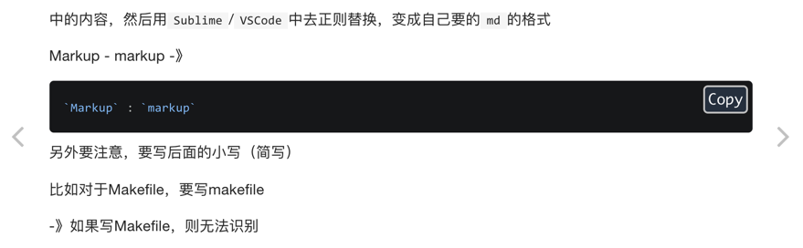

# Gitbook的注意事项和使用心得

折腾gitbook期间，也算踩过一些坑，总结了些经验，整理如下：

## 最新版本`Gitbook`的bug很多，以及没有命令行工具了

详见：

[【记录】gitbook升级到新版本](http://www.crifan.com/gitbook_upgrade_to_latest_new_version)

## 多章节的编号显示有问题

虽然开始好像是用插件支持了：

[【已解决】gitbook中安装multipart插件](http://www.crifan.com/gitbook_install_multipart_plugin)

[【已解决】Gitbook中添加章节的编号](http://www.crifan.com/gitbook_add_chapter_index_number)

但是最终还是没法正常的实现自己要的 章节按照1，2，3去编号：

[【部分解决】Gitbook中添加多章节且希望一级章节也显示编号](http://www.crifan.com/gitbook_add_multiple_chapter_first_leve_chapter_show_index_number)

后来又去试了试：

【未解决】Gitbook中实现多章节中一级章节目录显示一级编号

虽然找到了别人为了解决次bug而去改动的gitbook的源码的位置，但是由于无法找到

此处Mac中用`npm install gitbook`后，应该去哪里找到对应的位置，所以此处还是无法解决问题。

## 调试时添加`--log`以便于看到详细的错误信息

在用`serve`去调试本地的`gitbook`时，有些细节和错误，比如`markdown`的插件中语法写错了，是不知道，也看不到错误信息的。

而想要看到，则需要添加`--log`的参数，可以输出详细的log日志信息，从而可以看出原因和细节。

比如，[语法高亮插件](../gitbook_plugins/code_highlight.md)中用的是`prism`，而`markdown`源码写了个`md`的语法：

````markdown
```md
`Markup` : `markup`
```
````
时，结果log中即可看到错误信息：

```bash
gitbook serve /Users/crifan/GitBook/Library/Import/ebook_system_gitbook /Users/crifan/GitBook/Library/Import/ebook_system_gitbook/debug --log debug
...

debug: index page gitbook_plugins/code_highlight.md
Failed to load prism syntax: md
{ Error: Cannot find module 'prismjs/components/prism-md.js'
    at Function.Module._resolveFilename (internal/modules/cjs/loader.js:594:15)
    at Function.Module._load (internal/modules/cjs/loader.js:520:25)
    at Module.require (internal/modules/cjs/loader.js:650:17)
    at require (internal/modules/cjs/helpers.js:20:18)
    at requireSyntax (/Users/crifan/GitBook/Library/Import/ebook_system_gitbook/node_modules/gitbook-plugin-prism/index.js:31:3)
    at Object.code (/Users/crifan/GitBook/Library/Import/ebook_system_gitbook/node_modules/gitbook-plugin-prism/index.js:103:11)
    at Record.TemplateBlock.applyBlock (/Users/crifan/.gitbook/versions/3.2.3/lib/models/templateBlock.js:205:23)
    at /Users/crifan/.gitbook/versions/3.2.3/lib/output/getModifiers.js:56:33
    at /Users/crifan/.gitbook/versions/3.2.3/lib/output/modifiers/highlightCode.js:47:24
    at /Users/crifan/.gitbook/versions/3.2.3/lib/output/modifiers/editHTMLElement.js:11:16 code: 'MODULE_NOT_FOUND' }
```

如此，才真正知道自己写错了，然后才能想到，去参考[prism官网](http://prismjs.com)，找到并修改为正确写法是：`markdown`：

````
```markdown
`Markup` : `markup`
```
````

即可解决错误，代码能真正的语法高亮：



## 代码中包含花括号

【已解决】Gitbook中Markdown的代码中如何包含左右花括号{}

## 代码块显示代码行号

不过gitbook中的prism插件暂时还没有直接支持行号显示：

【未解决】Gitbook中Markdown的代码段中如何添加行号

## 跨页面引用和跳转

跨页面的话，貌似只能直接用链接地址了：

【已解决】gitbook如何实现book内部的跨页面的跳转或引用

后记：

已经实现了：

【已解决】gitbook中想要实现引用别的章节的内容

## 引用gitbook的root目录之外是不支持的

【未解决】gitbook中用markdown的include实现根目录外部的README.md文件内容同步

不过倒是可以通过:

```markdown

```

去引用gitbook内部的其他的章节的。

## 左侧添加下载PDF按钮

没有完全实现，间接实现了类似效果：

[【部分解决】给gitbook中左侧添加PDF及其他格式的下载按钮](http://www.crifan.com/gitbook_left_add_pdf_other_format_download_button)
